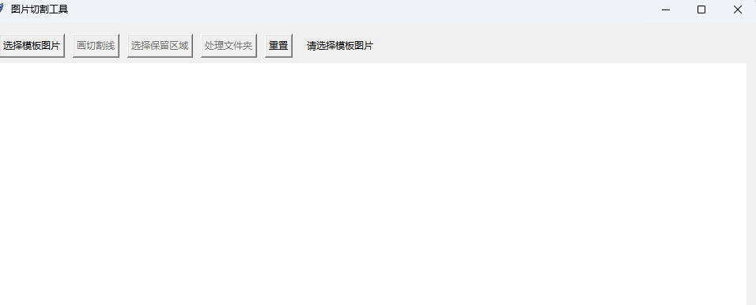

# 图片切割工具 (Image Cutter)

一个基于Python的图形界面工具，用于批量切割图片。支持自动拟合切割线到图像边缘，并可以批量处理文件夹中的所有图片（包括子文件夹）。

## 功能特点

- 🖼️ **图形界面操作**：直观的GUI界面，易于使用
- 📏 **智能切割线拟合**：自动将绘制的切割线延长到图像边缘
- 🎯 **精确区域选择**：支持选择保留左侧或右侧区域
- 📁 **批量处理**：支持处理整个文件夹及其所有子文件夹
- 🔄 **自动尺寸调整**：自动将处理图片调整为模板图片尺寸
- 💾 **覆盖保存**：直接覆盖原文件或可选择保存到新位置
- 📊 **实时进度显示**：处理过程中显示进度和当前文件

## 支持的图片格式

- JPEG (.jpg, .jpeg)
- PNG (.png)
- BMP (.bmp)
- TIFF (.tiff)

## 安装依赖

在运行程序前，请先安装所需的Python包：

```bash
pip install -r requirements.txt
```

或者手动安装：

```bash
pip install opencv-python==4.8.1.78 Pillow==10.0.1 numpy==1.24.3
```

## 使用方法

### 1. 启动程序

```bash
python image_cutter.py
```

### 2. 操作步骤

#### 第一步：选择模板图片
- 点击"选择模板图片"按钮
- 选择一张图片作为模板（所有处理图片将按此模板尺寸调整）
- 模板图片将显示在主窗口中

#### 第二步：绘制切割线
- 点击"画切割线"按钮
- 在图片上拖动鼠标绘制一条切割线
- **智能功能**：程序会自动将绘制的线延长到图像边缘，并修正为水平或垂直方向
- 切割线将以红色显示

#### 第三步：选择保留区域
- 点击"选择保留区域"按钮
- 在图片上点击选择要保留的区域：
  - 点击切割线**左侧**：保留左侧区域（绿色半透明显示）
  - 点击切割线**右侧**：保留右侧区域（蓝色半透明显示）

#### 第四步：批量处理
- 点击"处理文件夹"按钮
- 选择包含要处理图片的文件夹
- 程序将自动处理该文件夹及其所有子文件夹中的所有图片
- 处理进度和当前文件会实时显示

### 3. 重置操作

如果需要重新设置切割线或保留区域，可以点击"重置"按钮清除所有设置。

## 技术原理

1. **坐标转换**：程序实现了画布坐标与图像坐标的双向转换
2. **直线拟合**：使用数学计算将用户绘制的线拟合到图像边缘
3. **区域分割**：基于直线方程计算每个像素点的位置关系
4. **掩码处理**：使用OpenCV的位运算进行精确的区域切割
5. **自动裁剪**：找到保留区域的最小边界矩形进行智能裁剪

## 文件结构

```
picture_cut/
├── image_cutter.py    # 主程序文件
├── README.MD          # 使用说明文档
├── requirements.txt   # 依赖包列表
└── (处理后的图片文件)
```
程序运行效果：



## 注意事项

1. **备份重要文件**：程序会直接覆盖原文件，建议先备份重要图片
2. **图片尺寸**：所有处理图片将自动调整为模板图片的尺寸
3. **切割线方向**：程序会自动将切割线修正为水平或垂直方向
4. **处理时间**：大量图片处理可能需要较长时间，请耐心等待

## 故障排除

- **无法读取图片**：检查图片格式是否支持，文件是否损坏
- **界面显示异常**：尝试调整窗口大小或重启程序
- **依赖包问题**：确保所有依赖包已正确安装

## 版本信息

- 当前版本：1.0
- 最后更新：2024年
- 开发语言：Python 3.x

---

💡 **提示**：首次使用建议先用少量图片测试，熟悉操作流程后再处理重要文件。
